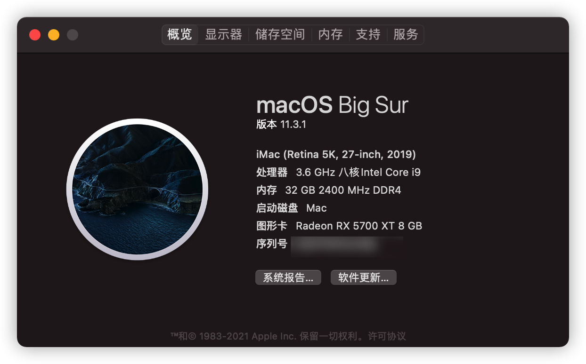
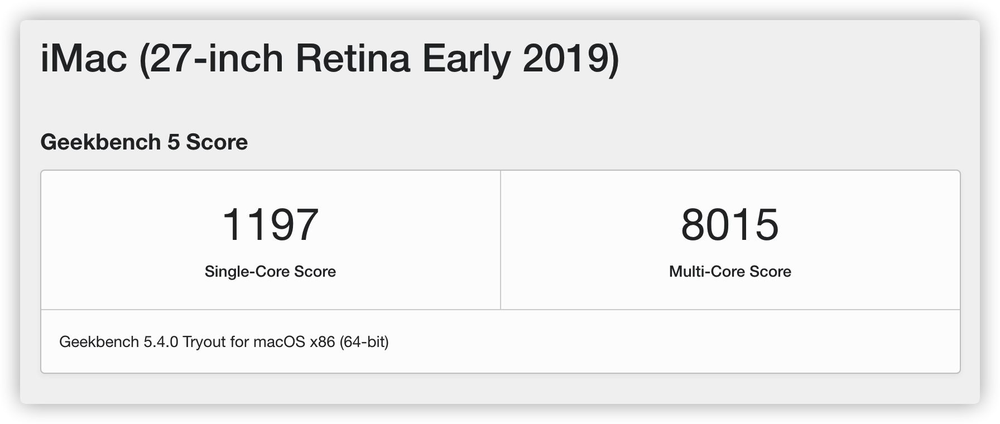
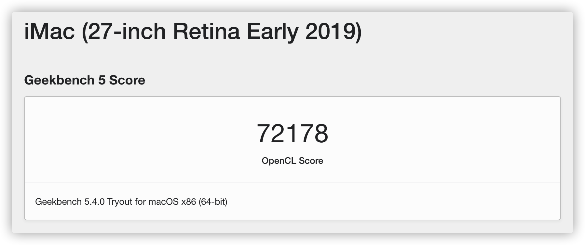
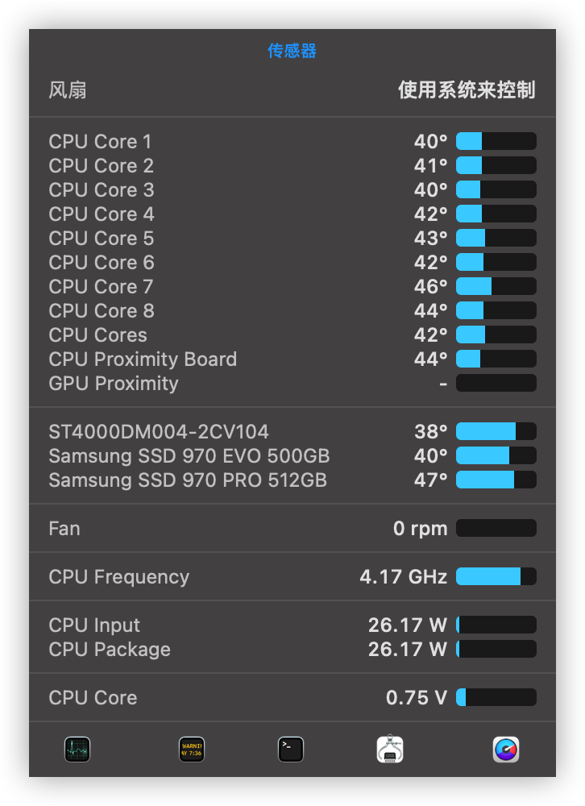

# OpenCore_ASUS_PRIME_Z390_9900K

## 硬件简介
OpenCore: ASUS PRIME Z390-A + 9900k + RX5700XT

[OpenCore-Desktop-Guide](https://dortania.github.io/OpenCore-Install-Guide/config.plist/coffee-lake.html)

## 系统信息

## **配置**

|  配件  | 型号  | 
|  ---- | ---- | 
|  CPU  | 9900K | 
|  内存  | DDR4 2400 x 4 | 
|  主板  | ASUS）PRIME Z390-A  | 
|  显卡  | (Sapphire)RX 5700 XT 8G D6 |
|  SSD  | Samsung PRO 970 |
|  BT/Wi-Fi  | Broadcom BCM43xx | 

## **EFI**

* boot args `agdpmod=pikera alcid=11`
* 新增ACPI
    - *SSDT-USBX.aml* 
    - *SSDT-PMC.aml*
    - *SSDT-PLUG.aml*
    - *SSDT-EC.aml*
    - *SSDT-AWAC.aml*
* 新增 the HfsPlus.efi driver
* 新增Kexts
    - *WhateverGreen.kext*
    - *VirtualSMC.kext*
    - *SMCSuperIO.kext*
    - *USBPorts.kext*
    - *SMCProcessor.kext*
    - *Lilu.kext*
    - *IntelSnowMausi.kext*
    - *IntelMausi.kext*
    - *AppleALC.kext*
* 关闭`XhciportLimit` 15个USB限制, 自定义USB端口

## **更新日志**
- 2021年05月20日
    - 升级Kexts
    - 升级`OpenCore`到6.9
    - 测试通过bigSur 11.3.1
